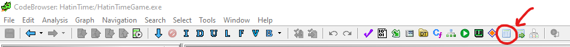
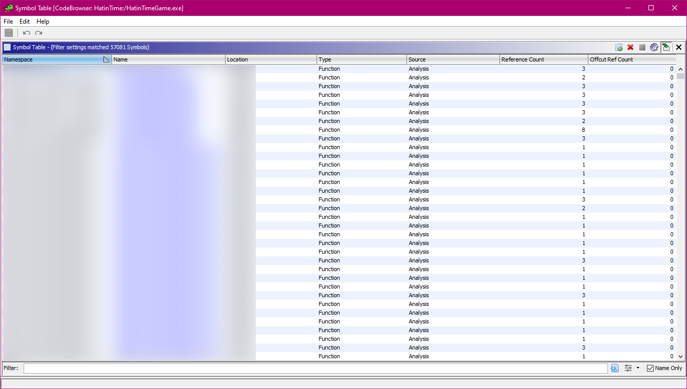
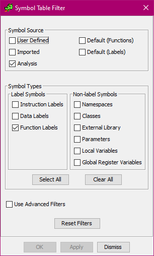

# A Byte in Time

A Hat in Time hacking toolkit.

## A word of warning

At this stage ABiT is still only a proof of concept. Expect major breakthroughs and major
breaking changes.

You have been warned.

## Why

So you may be saying this to yourself at this point: "but uncle liquidex, the hat game already has
modding support!!!11" And I know that!

But the thing with A Hat in Time Modding As The Developers Intended is that it's very *limited.*
You're confined to the limits of what adding new classes in UnrealScript can provide, and although
the game is mostly written in UnrealScript anyways, doing more advanced things that intend to modify
the base game is quite a pain. Which is why you only ever see mods that *add* content on the
Workshop.

Because, say you want to modify an existing piece of GUI? Ha ha ha, ***good luck!***

Which is where ABiT comes in.

## What

As mentioned already, ABiT is a hacking toolkit for A Hat in Time. Its purpose is to expose the
internals of the game such that **You** can play around with them in ways the developers never even
thought of. Want to make the in-game speedrun timer display 4:20 at all times?
[Got you covered](src/mods/example_fourtwenty/).

ABiT is split into a few modules, each one fulfilling a single purpose:
- **The Launcher,** which handles starting the game up, and injecting into it a tiny lil' DLL called
- **The Loader.** This piece of code is responsible for handling the basic logic of patching into
  the game's code, and exposing that functionality to mod DLLs, which it loads before the game is
  even ready to *think* about initializing anything.
- **The Procs.** All of that is nice and dandy, but we actually need to know which functions to
  patch into - as in, *where the heck they actually are in memory.* Unfortunately this task is made
  quite difficult by the fact that HatinTimeGame.exe is... well, an .exe, and as such does not
  export any symbols, so good ol' `GetProcAddress` is not going to cut it.
  So, it's time to bring out The Big Guns.™ We use Ghidra and the innocuous little .pdb file that
  ships next to the game's .exe, and bada bing, bada boom, *your symbols are now in my room.*
  We export a CSV file out of Ghidra containing the symbol table, and process it into a load of
  header files and a single .cpp file containing all the symbol data, using a Python script.
  - Using a DLL allows us to have at least *some* level of cross-version compatibility.
    The launcher, loader, and mods can potentially stay at the same version for many updates to
    A Hat in Time, and you'll only need to replace `AByteInTime.Procs.dll` with each update.
    Of course ABI compatibility is another thing, because the DLL does not contain any information
    about function signatures, so if any of them changes, your mod crashes and burns.
- **The Yarnbox,** which is still in its infancy.
  The Yarnbox is going to be a native mod which enables UnrealScript bytecode patching
  functionality, very much akin to what's done in [Minecraft modding][mcmods] with [Mixin].
  - When this will come out, I have no idea; it'll probably take me a while until I have a PoC
    for this because I need to reverse engineer how the UnrealScript VM actually works under the
    hood.

  [mcmods]: https://fabricmc.net/
  [Mixin]: https://github.com/SpongePowered/Mixin

## How

Right now using ABiT requires a lot of setup to get going, but it's not impossible.

### Prerequisites

- Clang >= 15
  - Other compilers (such as MSVC) are not tested. Beware.
- CMake >= 3.24
- Ghidra >= 10.2.2
- A Hat in Time

Older versions may work but haven't been tested.

### Procuring symbols

Because ABiT relies on knowing where symbols are located within the executable ahead of time, we
need to extract this information for build time.

1. **Create a new Ghidra project.**

1. **Open HatinTimeGame.exe in Ghidra.** You can find the .exe by right-clicking on A Hat in Time
   in Steam, clicking Manage -> Browse local files, and navigating to Binaries\Win64.
    - 32-bit is not supported.

1. **Let Ghidra analyze the executable.** This should be obvious enough.
   **Do not untick any boxes.**

1. Once Ghidra's done analyzing, **open the symbol table.**

   

1. **Arrange the columns in the order _Namespace, Name, Location._** The other columns are
   irrelevant to the build process.

   

1. **Press the cog button in the upper right corner of the Symbol Table window to edit the filter.**
   **Configure the filter to only include symbols coming from _Analysis_, and to only include _Function Labels_.**

   

1. It's time to export the CSV! **Hit <kbd>Ctrl</kbd> <kbd>A</kbd>, right-click, choose Export -> Export to CSV.** You should save the file under src/abit/procs/procs.csv in this repository.

#### Why are these not checked in

Legal reasons. I do not want to use GfB's symbol table without their written permission, and it's
too early for me to ask at this point.

This process will probably be automated with a build script in the future, but for now it is what
it is.

### Building the toolkit

Now all that's left is to build the toolkit. This can be done with a couple PowerShell scripts:
```powershell
# Before building:
PS> .\scripts\setup.ps1
# To (re-)build:
PS> .\scripts\build.ps1
# To build and run the launcher:
PS> .\scripts\buildAndRun.ps1
```
